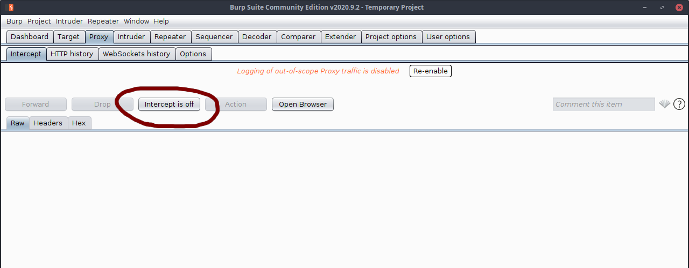
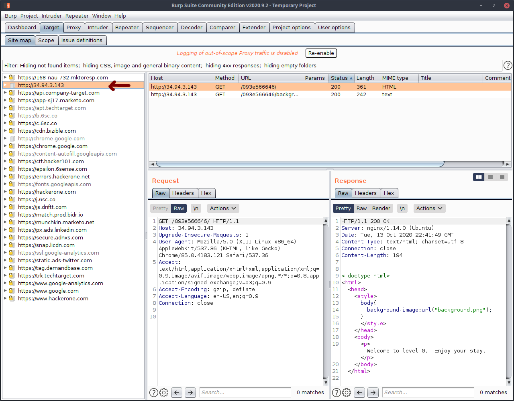
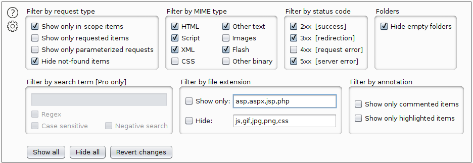
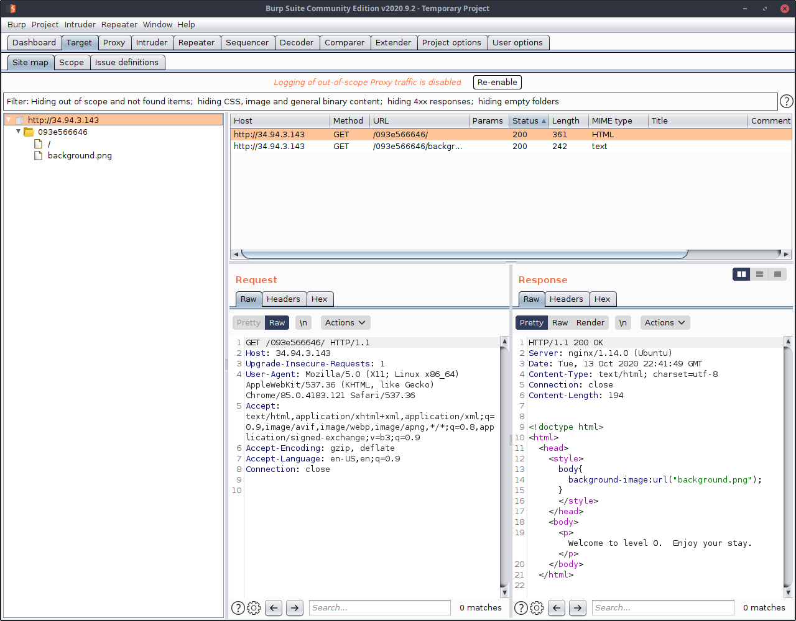
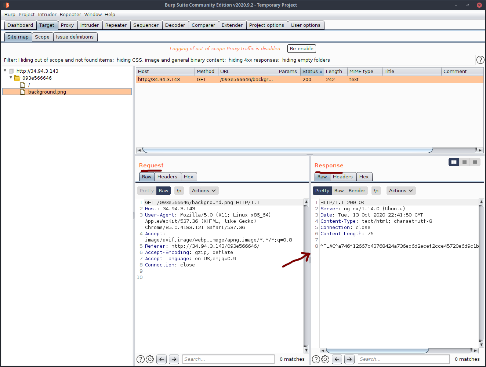

### Trivial
Host: Hacker101

Description: A little something to get you started

Type: Web

Difficulty: Easy

No. Flags: 1

#### Initial Setup

To solve this CTF you're going to need only Burpsuite. To install burpsuite go to <https://portswigger.net/burp/communitydownload> and download the latest *Community Edition*. 

Full installation instructions can be found on the Portswigger (burpsuite) page.

#### Defining the Scope

With Burp started and intercept turned off, navigate to the [challenge page](https://ctf.hacker101.com/ctf/launch/1)

Your burp tree should populate with all sorts of URLs. 

Since we are only interested in the page we are working on, we will add it to our *in scope* items by right clicking and selecting `add to scope`

This puts it into our in scope items but we dont want to be bothered by the rest of the URLs so click the filter bar just about the list and select `show only in scope items`.

This should remove all other URLs and show only the domain/ip address we are working with.

Expand the tree and take a look at the files present on the server. It seems to be extremely simple and serve up almost nothing. In fact, only a single file is there standing out: `background.png`

Considering the page we are looking at has only a white background, this seems odd. So click on the image in Burp to select it and peruse what information we are being provided.

Keen eyes are going to notice immediately that we can see the flag in the HTTP response.

No more work is needed, this challenge is solved. Copy the `^FLAG^...` from the reponse box and submit it on the Hacker101 page. 

