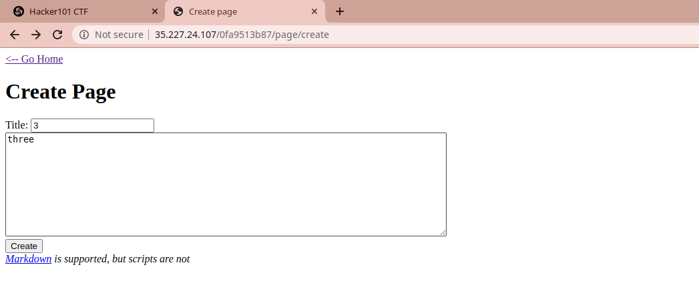
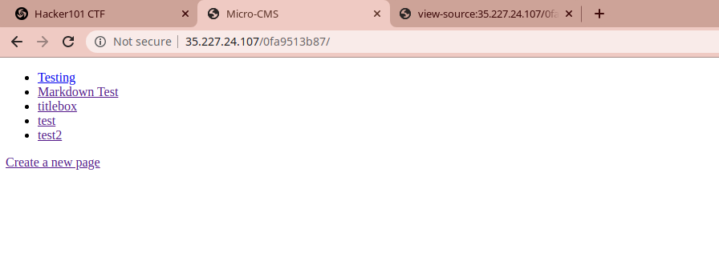
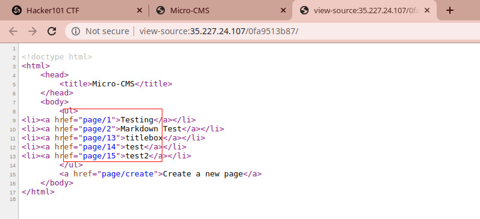
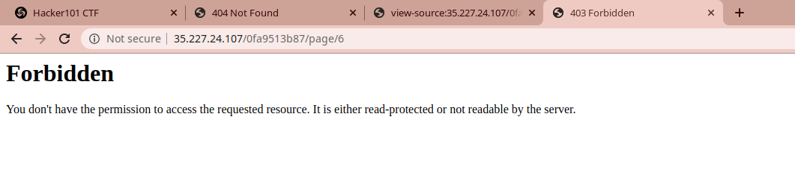
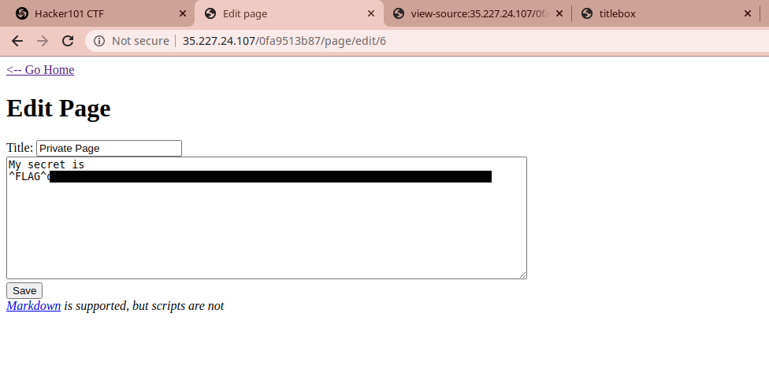
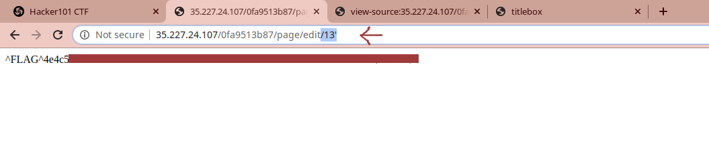
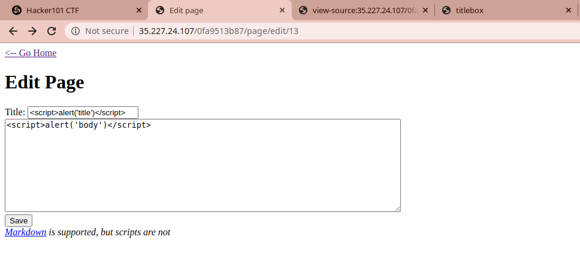
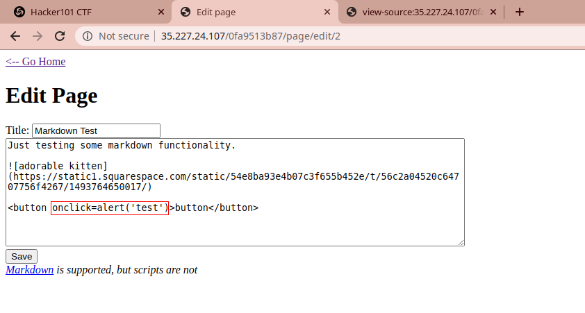
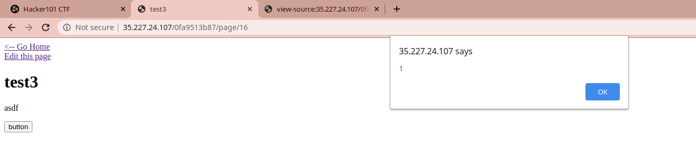
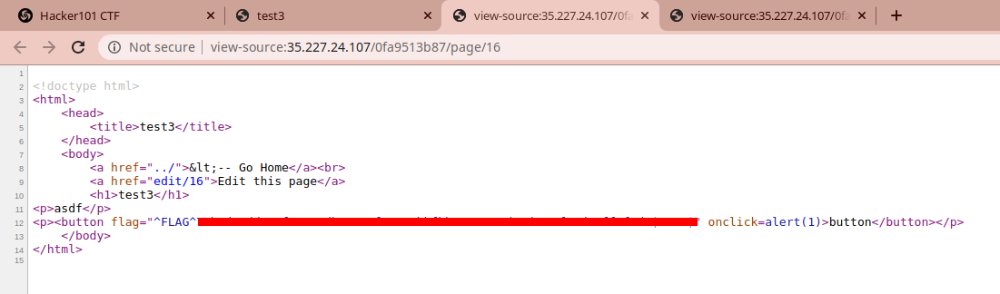

### Micro CMS v1
Host: Hacker101

Description: ?

Type: Web

Difficulty: Easy

No. Flags: 4

#### Flag 1

The first step of any *bug hunt* is navigating and understanding the page or application you are working with. This means clicking on all the links, visiting every page, and interacting with every box. As you do that with this challenge you'll quickly come across the *"Create Page"* area.

Go ahead and create a few pages with whatever information you choose to fill it. Once you've done that, go back to the home page. There you should see your created pages listed. 

If you didnt look at the source code earlier, go ahead and look at it on the home page now.

Nothing immediately stands out here, but if you pay close attention you'll notice the pages go from 1, 2, and immediately jump up to 13, 14, 15. Its fine details like this that should be peaking your curiousity. Lets explore those missing numbers by switching the page numbers out in the URL. Cycle through them.. *3.. 4.. 5..* and when you get to 6 you should see..

None of the other pages returned anything, be page six gives us `Forbidden`. This means there is at least something there. Checking the source and the other remaining pages gives nothing. However - earlier we saw that there are edit options for the create pages. Can we edit page 6? Clicking on *edit* for an existing page and substituting that page number for `6` in the URL brings success!

#### Flag 2

With the first flag out of the way, keep perusing the page. I didn't find anything else catching my attention right away so I decided to play with the URL some more. Throwing parameters at it didn't net any results, but adding an apostrophe (`'`) as in SQL Injection attack immediately netted a flag.

#### Flag 3

With 2 flags based on URL manipulation its about time we looked at some cross-site scripting. The create and edit pages both have text input areas, so head over to the *edit* page again and we'll try basic injections.

Here you can see a standard XSS attack with ``. Put it in both the *Title* section and the body and save the edit. This takes you back to the URL for the edited page and we can see the `` tags have been stripped from the body, but nothing else occurs. We'll leave the edited page and navigate around the site some more and check if our XSS propogates or appears anywhere else.

I have no screenshot of this flag, but navigating home will net you the 3rd flag. It appears the XSS in the title triggers when you hit the home page.

#### Flag 4

Lastly, we'll move to the *"Markdown Test"* page that was present when we started the challenge. In the Markdown Test page you'll find a *button* that wasn't present anywhere else and not something we included on our manually created pages. This is a cookie crumb. Move to the edit option of the *Markdown Test* page and we'll work on manipulating this button. 

Another for of XSS we can perform is adding an `onclick` function to the button.

Add `onclick=alert('test')` to the `button` tag and save the page. Now, when we navigate to the *Markdown Test* page and click the button it should (if vulnerable) trigger our javascript. 

Here is a screenshot of a different page trigger the same script on a button

Our script ran, but no flag appeart. Only the alert we entered. However if we now look at the page source - we'll now find the last flag.

Gather up your 4 flags and submitted them on <ctf.hacker101.com> -- you're finished!
